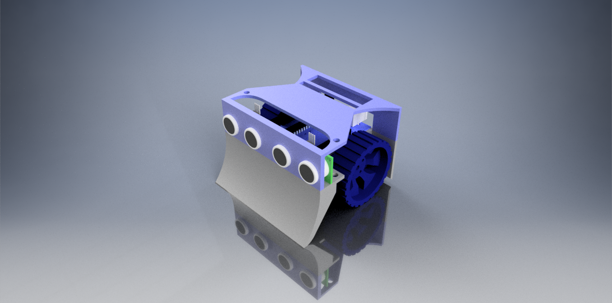

# Sumobot Challenge
## Team Robonauts

  
  

### TODO:
- [x] **Movement**
    - [x] Motors
        - [x] Motor Control Code
    - [x] Shafts
    - [x] Wheels

- [x] **Sensors**
    - [x] Ultrasonic Sensors
        - [x] Ultrasonic Distance Code
    - [x] Line Sensors
        - [x] Line Detection Code
    - [ ] Accelerometer
        - [ ] Detecting Forced Movement

- [ ] **Logic (State Machine)**
    - [x] Receiving Data From All Sensors
    - [x] Making Decisions
        - [ ] Avoiding Collision
        - [x] Attacking
        - [x] IDLE 

- [ ] **Circuitry**
    - [ ] Bridge Driver 
        - [ ] L298 
        - [ ] DRV8848
    - [ ] PCB or Protoboard

- [ ] **MCU**
    - [x] Arduino
    - [ ] Maple (STM32)
    - [ ] Particle Photon

- [x] **Chassis**
    - [x] CAD Design
    - [x] Materials
        - [x] 3D Printing

- [ ] **Power**
    - [x] Batteries:
        - [ ] Li-Po
        - [x] Li-Ion
    - [ ] Voltage Regulators (Powering the MCU)

